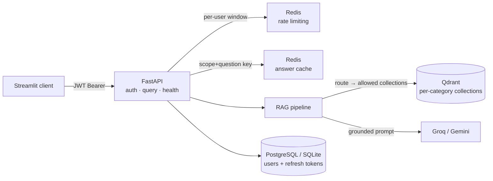

# Company Policy Copilot


Grounded Q&A over **a company's internal policy knowledge base** — policies spread across HR, Finance, IT Security, Legal Compliance and Operations. Employees ask the same questions repeatedly; this answers them **only from the official documents**, scoped to what each role is allowed to see.

```
"How many days of casual leave do I get?"        → grounded answer + sources (cached: ~ms)
"What is the bonus formula for L4?" as employee  → access denied (RBAC, enforced at retrieval)
```

## The problem it solves

In any growing company the same policy questions land on HR and team leads every single week — *leave balances, expense limits, probation rules, bonus eligibility*. The answers exist, but they are buried inside department documents spread across wikis, shared drives and PDFs — and some of them (salary bands, bonus formulas) are sensitive. Generic chatbots make all of this worse: they hallucinate numbers, ignore access rules, and bill you tokens for every repeat.

| Real pain | What this repo does about it |
|---|---|
| HR keeps answering the same ~20 questions | Self-serve assistant; identical questions served from cache in milliseconds, zero LLM cost |
| One answer is split across departments — *"referral bonus timing"* lives in Recruitment **and** Compensation | Keyword router selects the right collections; multi-hop questions pool across all allowed ones |
| LLMs confidently invent numbers (made-up leave days that don't match the official policy) | Grounded generation — answers come only from retrieved chunks, and every response cites its sources so employees can verify |
| Sensitive policies must not leak (salary bands, bonus formulas) | RBAC is enforced **inside retrieval**: an employee's request never touches compensation vectors — a forgotten route check can't leak anything |
| Real users type paraphrases/Hinglish that break keyword search | Hybrid BM25 + dense retrieval handles *"mera baby hone wala hai, third child, kitni maternity leave milegi?"* → 12 weeks |
| Uncontrolled usage silently burns API budget | Per-user sliding-window rate limits; if Redis is down the service fails closed instead of running unthrottled |

**A representative exchange** (from the eval set):

> **Q:** *mera baby hone wala hai, third child, kitni maternity leave milegi?*
> **A:** For the third child onwards, maternity leave entitlement is 12 weeks — reduced from the 26 weeks given for the first two children.
> **Sources:** Leave Policy — *"…third child onwards… reduced entitlement…"*

## How it works



**Request path:** JWT check → rate limit → cache lookup (permission-guarded) → keyword routing over role-allowed categories → per-category vector search → grounded prompt → answer + cited sources.

## Design decisions

- **Category-scoped retrieval** — each department gets its own Qdrant collection; a finance question never searches IT or Legal. Smaller search space, and it's what makes RBAC cheap.
- **RBAC at the retrieval layer, not the route** — an employee-role request *cannot* reach compensation chunks even if a route check is forgotten; `allowed_categories` bounds every collection touch.
- **Permission-guarded cache** — cached answers are reused only if their source categories are a subset of the asking user's role. A privileged answer is never served to a lower role.
- **Deterministic routing** — explicit category validated against role first; otherwise keyword hits pick collections; ambiguity falls back to all allowed categories.
- **Fail-closed dependencies** — Redis down ⇒ login/query return 503 rather than running unthrottled.
- **Retry, not circuit breaker** — two retries on flaky LLM calls; a real breaker matters at traffic this tool doesn't see.

## Quickstart

```bash
python -m venv .venv && source .venv/bin/activate   # Windows: .venv\Scripts\activate
pip install -e .
cp .env.example .env        # add GROQ_API_KEY + JWT_SECRET_KEY (openssl rand -hex 32)
python scripts/ingest.py    # builds the per-category Qdrant collections once
docker compose up -d redis  # rate limiting + caching backend
uvicorn hr_rag.api.main:app --port 8000
streamlit run frontend/app.py
```

Or everything containerized: `docker compose up --build` (PostgreSQL + Qdrant + Redis + FastAPI), then Streamlit separately.

**Windows one-click:** `run-hr.bat` starts the API on `:8001` and the UI on `:8502` (off the default ports, so it coexists with other projects on 8000/8501) under `API_URL=http://localhost:8001`. Requires Redis + Qdrant running (`docker compose up -d redis qdrant`).

## API

| Method | Path | Auth | Notes |
|---|---|---|---|
| POST | `/auth/signup` | — | always creates `employee`; elevated roles via provision |
| POST | `/auth/login` | — | 5 attempts/min/user; issues access (30 min) + single-use refresh (7 days) |
| POST | `/auth/refresh` | refresh token | rotation: old token consumed, replay → 401 |
| POST | `/auth/provision` | `hr_admin` | create users with any role |
| POST | `/query` | any user | `{question, category?}` → answer + cited sources |
| GET | `/health` | — | Redis connectivity + pipeline status |

```bash
curl -X POST localhost:8000/auth/login -H "Content-Type: application/json" \
  -d '{"username": "employee1", "password": "employee123"}'

curl -X POST localhost:8000/query -H "Authorization: Bearer <token>" \
  -H "Content-Type: application/json" \
  -d '{"question": "How many days of casual leave do I get?"}'
```

Seeded demo users: `employee1/employee123`, `manager1/manager123`, `hradmin1/hradmin123`.

## Security model

- bcrypt password hashing; JWTs carry `sub/type/jti`, signature verified on every call
- Refresh tokens are **single-use and stored hashed** — a stolen token can't be replayed after rotation
- Roles map to category allow-lists (`rbac.py`); compensation stays manager+ / hr_admin only
- Placeholder `JWT_SECRET_KEY` refuses to boot
- CORS restricted to known frontend origins

## Evaluation

An evaluation set ([`data/eval/qa_dataset.py`](data/eval/qa_dataset.py)) keeps the system honest — questions tagged by category, difficulty and type (numeric / factual / multi-hop / paraphrase / unanswerable), each with ground-truth answers verified against the source documents, including deliberately unanswerable ones to catch hallucination. [`notebooks/experiments.ipynb`](notebooks/experiments.ipynb) compares baseline, hybrid, query-rewrite, multi-query, compression, metadata-filter, HyDE and cross-encoder retrieval with RAGAS (faithfulness, context precision/recall). Winning setup shipped in this repo: **hybrid BM25+dense over per-category Qdrant collections**.

## Observability

Every prompt/LLM run is traced to **LangSmith** (project `HR-RAG-Experiments`: inputs, outputs, token usage, latency); MLflow tracks the offline experiments.

Structured **JSON logging** (one parseable line per event, correlated by a per-request `request_id`) and a Prometheus **`/metrics`** endpoint expose the signals that matter for ops: query volume + end-to-end latency histogram, **cache hit-ratio gauge**, auth outcomes, RBAC denials, and LLM calls/fallbacks. Point a Prometheus scraper at `/metrics` and alert on latency / hit-ratio / 5xx.

## Reliability

- **LLM failover**: all providers go through **LiteLLM** — answers run on the configured provider and fail over transparently to the other via `with_fallbacks`, with built-in retries — a provider outage no longer hard-fails `/query`.
- **DB setup**: the ORM layer runs on SQLite locally and PostgreSQL in Docker by toggling `DATABASE_URL`; tables are created automatically at startup (`init_db`), `psycopg` ships by default.
- **Qdrant server mode**: `QDRANT_URL` points at the compose qdrant service (dashboard on `:6333/dashboard`); multi-process-safe, vs. the single-process embedded mode when unset.

## Testing & layout

**61 tests** — self-contained: `54` unit (auth/RBAC, routing, chunking, dataset integrity) + **7 end-to-end integration** over the wired routers (signup → login → refresh rotation → single-use replay rejection → RBAC enforcement), all with SQLite + `RATE_LIMIT_ENABLED=false` (no Redis/keys needed). CI runs ruff + pytest on every push/PR.

```text
data/policies, data/eval   corpus + eval set
src/hr_rag                 RAG library (load/chunk/embed/route/retrieve/pipeline)
src/hr_rag/api             FastAPI service (auth, rbac, cache, rate limit, guardrails, metrics, routes)
frontend/app.py            Streamlit client
scripts/ingest.py          builds Qdrant collections offline
tests/, docker/, docs      suite, compose stack, deploy notes
render.yaml, run-hr.bat    deploy + one-click local launch
```

## Deployment

[`render.yaml`](render.yaml) + [`docs/deploy.md`](docs/deploy.md) lay out a managed stack (Postgres, Redis, Qdrant cluster, API on Render/Railway). `run-hr.bat` is a one-click local launcher that runs the API on `:8001` and UI on `:8502` (side-by-side with projects that own 8000/8501) under `API_URL`.

## Known gaps

Single-tenant auth (no external IdP/SSO), no LLM **circuit breaker** (retry + failover exist, breaker is for higher-traffic prod), metrics without an attached Grafana/Prometheus stack. Tracked for the next iteration.
